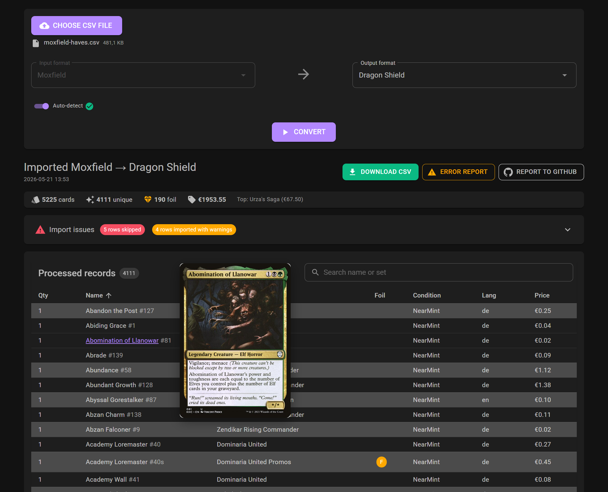

# MtG Csv Helper

A free, browser-side converter for Magic: The Gathering collection CSVs between popular sites. Your file never leaves your machine — everything runs as Blazor WebAssembly in the tab.

➡️ **[Try it now: stepkie.github.io/MtgCsvHelper](https://stepkie.github.io/MtgCsvHelper/)** &nbsp; ·&nbsp; [CHANGELOG](CHANGELOG.md) &nbsp; ·&nbsp; [Conversion limitations](CONVERSION_LIMITATIONS.md)



## TL;DR

1. Upload input CSV file.
2. The input format is auto-detected from the headers; toggle off to pick manually. Pick the output format.
3. Click **Convert**. Larger collections take a moment.
4. Download the converted CSV. The results table shows per-row issues and totals.

When a new version ships, the app shows a "Reload to update" banner — click it to swap in the latest build. (The service worker keeps an offline copy of the previous version until you do.)

## Supported formats

Both import and export, unless noted.

| Format | Notes |
| --- | --- |
| Moxfield | |
| Dragon Shield | |
| Manabox | |
| Topdecked | |
| Deckbox | Curated edition names + legacy edition codes are aliased back to Scryfall codes on read/write. |
| MTGGoldfish | |
| TCGplayer | |
| Archidekt | |
| MTGO | 2-letter legacy codes (MI/VI/TE/EX) canonicalized to 3-letter Scryfall codes (MIR/VIS/TMP/EXO); `N/M` collector numbers stripped. |
| Cardmarket | Import only — resolves rows by `idProduct` via Scryfall reverse lookup. |
| Card Kingdom | Export only — 4-column buylist shape, no condition/language/foil-etched. |

Open an issue if you want a new site supported.

## Limitations / Known Issues

* **Data loss between formats is sometimes unavoidable.** See [CONVERSION_LIMITATIONS.md](CONVERSION_LIMITATIONS.md) for the full per-format matrix — what each platform supports (Etched, conditions, languages, set-name aliases) and where round-trip conversions silently coerce or drop fields. Read it before you trust a cross-format round-trip.
* Sites that export data in non-standard formats for certain sets (i.e., not adhering to Scryfall syntax) may cause issues for certain cards when rewriting to another format
  * most often, this relates to non-standard set or card names. Examples are compilation sets like Mystery Boosters or how special printings (Borderless, etc.) are encoded
  * e.g. examples: issues [#23](https://github.com/StepKie/MtgCsvHelper/issues/23),  [#24](https://github.com/StepKie/MtgCsvHelper/issues/24),  [#3](https://github.com/StepKie/MtgCsvHelper/issues/3)


## Project Info

Built originally to bridge card-scanner exports ([Manabox](https://www.manabox.app/), [MtG DragonShield Card Manager](https://mtg.dragonshield.com/)) into mainstream collection managers ([Moxfield](https://www.moxfield.com/collection), [Deckbox](https://deckbox.org)) without manual header-shuffling. Also handles the inverse: keeping a collection in sync across multiple sites.

The cumbersome bits the tool takes care of for you:

* **Card names** — some sites only emit the front face of double-faced cards; we expand to the full Scryfall name.
* **Set info** — missing set codes or set names, non-standard set names (Deckbox in particular curates its own vocabulary).
* **Foil** — different sites encode "foil"/"nonfoil"/"etched" with different strings.
* **Condition** — sites use 6 or 7 levels with varying vocabulary; we map between them (with documented information loss when mapping to a coarser scale).
* **Language** — short codes vs. full names.
* **Price** — currency, separator, and symbol position all vary.

All site-specific behavior lives in `MtgCsvHelper/appsettings.json` so adding a format is configuration, not code.

## How to use

### Browser

The web app at <https://stepkie.github.io/MtgCsvHelper/> covers the common path. Unlike the console version, the in-browser tool doesn't expose `appsettings.json` for live tweaking, but it works for any default-shaped CSV from a supported site.

### Console

* Prerequisite: [.NET 10 SDK / Runtime](https://dotnet.microsoft.com/download/dotnet/10.0).
* Download a release zip from the [Releases tab](https://github.com/StepKie/MtgCsvHelper/releases), or build from source with `dotnet build MtgCsvHelper.slnx`.
* Run `dotnet run --project MtgCsvHelper.Console` — `--help` lists all flags.
  * `--in` is optional; when omitted, the input format is auto-detected from each file's CSV header. Pass `--in MOXFIELD` (etc.) to skip detection.
* `MtgCsvHelper/appsettings.json` carries the per-format column mappings and is checked into the repo; tweak it if you want to add a new format or override a column.

### Refreshing the bundled reference data

The web app and console ship with a Scryfall reference bundle (`cards.min.json.gz`, ~10 MB)
under `MtgCsvHelper.BlazorWebAssembly/wwwroot/data/`. This avoids hitting the Scryfall
API at runtime for static lookups (set names, double-faced names, tokens).

To regenerate locally — e.g. after a new MtG set release:

```bash
dotnet run --project tools/MtgCsvHelper.RefreshReferenceData
```

This downloads Scryfall's `default_cards` bulk file, strips it to the fields the catalog needs, and writes the gzipped bundle to the default location above. The Console and test projects pick it up on the next build via `<None CopyToOutputDirectory>`. CI regenerates the bundle on every deploy.

Two sibling sub-commands:

* `-- cardmarket-fixture` — regenerates `Tests/cardmarket-reference-collection.csv` from the Moxfield reference via the Scryfall reverse lookup.
* `-- deckbox-aliases` — scrapes [deckbox.org/editions](https://deckbox.org/editions) and emits `Resources/deckbox-set-aliases.json` (Deckbox edition names that diverge from Scryfall canonical) and `Resources/deckbox-code-aliases.json` (Deckbox-internal codes like `ex_127` mapped back to Scryfall codes).


## Troubleshooting

Report bugs and feature requests by opening a [new issue](https://github.com/StepKie/MtgCsvHelper/issues/new/choose). The PWA shows a **"Reload to update"** banner when a new version is available — click it instead of clearing the whole browser cache. The current version is shown in the bottom of the app bar and links to the [CHANGELOG](CHANGELOG.md).

## Format configuration

All site-specific column mappings live in `MtgCsvHelper/appsettings.json` — a single source of truth shared between Console, Tests, and the Blazor app (the latter via a build-time copy into `wwwroot/`). Adding a new format means dropping in a new entry; PRs welcome.

Example entry — Moxfield:

```json
"MOXFIELD": {
  "Quantity": "Count",
  "CardName": {
    "HeaderName": "Name",
    "ShortNames": false
  },
  "SetCode": "Edition",
  "SetName": null,
  "SetNumber": "Collector Number",
  "Finish": {
    "HeaderName": "Foil",
    "Normal": "",
    "Foil": "foil",
    "Etched": "etched"
  },
  "Condition": {
    "HeaderName": "Condition",
    "Mint": "Mint",
    "NearMint": "Near Mint",
    "Excellent": "Near Mint",
    "Good": "Good (Lightly Played)",
    "LightlyPlayed": "Played",
    "Played": "Heavily Played",
    "Poor": "Damaged"
  },
  "Language": {
    "HeaderName": "Language",
    "Mappings": {
       "en": "English",
       "es": "Spanish",
       "fr": "French",
       "de": "German",
       "it": "Italian",
       "pt": "Portuguese",
       "ja": "Japanese",
       "ko": "Korean",
       "ru": "Russian",
       "zhs": "Chinese",
       "zht": "Traditional Chinese"
    }
  },
  "PriceBought": {
    "HeaderName": "Purchase Price",
    "Currency": "EUR",
    "CurrencySymbol": "Absent"
  }
}
```

* The right-hand side of each mapping is the CSV header used by that site.
* `Finish`, `Condition`, `Language`, and `PriceBought` are rich sub-configs because sites encode them differently.
* The `Condition` scale varies by site (6 vs 7 values, different vocabulary) — see [CONVERSION_LIMITATIONS.md](CONVERSION_LIMITATIONS.md) for the per-format collapse table.
* `Language.Mappings` only needs to be set when the site uses non-ISO codes.
* `CARDKINGDOM` is a write-only buylist format (4 columns, no condition/language/foil-etched). `CARDMARKET` is import-only — it identifies cards by `idProduct` and we Scryfall-reverse-lookup the rest.

Tracked feature and quality work lives in [issues](https://github.com/StepKie/MtgCsvHelper/issues).
